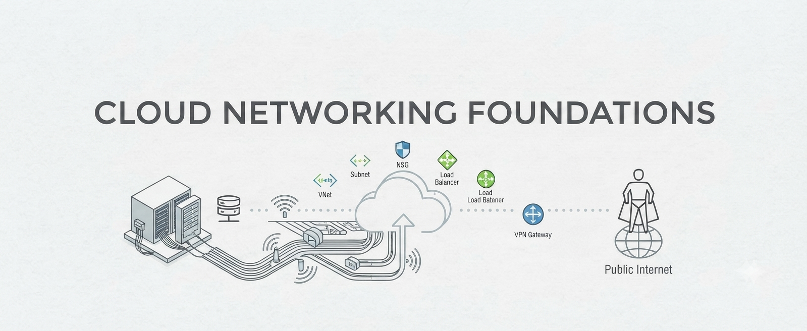

<div align="center">



<br><br>


<br>


</div>

<div align="center">

# Networking — Foundation for Cloud

### 🌐 Networking concepts required for Cloud, On-Premises, DevOps, and Infrastructure Engineering.

</div>

---

## 📖 About This Repository

**Networking Foundation for Cloud** is a structured learning repository focused on the networking concepts required to build and manage modern infrastructure environments.

The repository focuses on **networking fundamentals, enterprise networking, cloud connectivity, security, and troubleshooting** rather than platform-specific implementations.

The concepts learned here will be applied later while working with Azure, AWS, Windows Server, Linux, virtualization, Docker, Kubernetes, and DevOps infrastructure.

By the end of this repository, you will be able to:

- ✅ Understand how network communication works
- ✅ Understand OSI and TCP/IP models
- ✅ Design and understand IPv4 networks and subnetting
- ✅ Understand switching, VLANs, and Layer 2 communication
- ✅ Understand TCP, UDP, ICMP, ports, and connections
- ✅ Understand DNS and DHCP
- ✅ Understand routing and BGP/OSPF fundamentals
- ✅ Understand NAT, firewalls, and network security
- ✅ Understand load balancing concepts
- ✅ Understand VPN and hybrid connectivity
- ✅ Understand TLS and network certificates
- ✅ Troubleshoot common network connectivity problems

---

## 📚 Table of Contents

## 1. Networking Fundamentals

This section introduces the fundamentals of computer networking — how networks work, how devices communicate, and the core concepts required to understand modern infrastructure networking.

📂 **[Explore → Networking Fundamentals](./Networking%20Fundamentals/)**

---

## 2. OSI and TCP/IP Models

This section explains the OSI and TCP/IP networking models, their layers, responsibilities, encapsulation, decapsulation, and how network communication can be understood and troubleshot layer by layer.

📂 **[Explore → OSI and TCP/IP Models](./OSI%20and%20TCP%20IP%20Models/)**

---

## 3. Ethernet, MAC and ARP

This section covers Layer 2 communication, Ethernet frames, MAC addresses, MAC address learning, ARP, broadcast domains, and how devices communicate within a local network.

📂 **[Explore → Ethernet, MAC and ARP](./Ethernet%2C%20MAC%20and%20ARP/)**

---

## 4. Switching and VLANs

This section explains Layer 2 switching and network segmentation using VLANs. It covers access and trunk ports, 802.1Q, inter-VLAN communication, and basic loop prevention concepts.

📂 **[Explore → Switching and VLANs](./Switching%20and%20VLANs/)**

| # | Sub-Topic | Description |
|---|-----------|-------------|
| 4.1 | [Introduction to Switching](./Switching%20and%20VLANs/Introduction%20to%20Switching/) | Layer 2 switching, frame forwarding, MAC learning, and switching fundamentals |
| 4.2 | [VLANs](./Switching%20and%20VLANs/VLANs/) | VLAN concepts, VLAN IDs, segmentation, and broadcast domains |
| 4.3 | [Access and Trunk Ports](./Switching%20and%20VLANs/Access%20and%20Trunk%20Ports/) | Access ports, trunk ports, and VLAN traffic |
| 4.4 | [802.1Q VLAN Tagging](./Switching%20and%20VLANs/802.1Q%20VLAN%20Tagging/) | VLAN tagging and 802.1Q frame structure |
| 4.5 | [Inter-VLAN Routing](./Switching%20and%20VLANs/Inter-VLAN%20Routing/) | Communication between different VLANs using Layer 3 routing |
| 4.6 | [STP Fundamentals](./Switching%20and%20VLANs/STP%20Fundamentals/) | Switching loops, root bridge, STP, and loop prevention |
| 4.7 | [Link Aggregation](./Switching%20and%20VLANs/Link%20Aggregation/) | Link aggregation and LACP fundamentals |

---

## 5. IP Addressing and Subnetting

This section covers IPv4 addressing and subnetting — one of the most important networking foundations for cloud and infrastructure engineering.

📂 **[Explore → IP Addressing and Subnetting](./IP%20Addressing%20and%20Subnetting/)**

| # | Sub-Topic | Description |
|---|-----------|-------------|
| 5.1 | [IPv4 Addressing](./IP%20Addressing%20and%20Subnetting/IPv4%20Addressing/) | IPv4 structure, network and host portions, and address types |
| 5.2 | [Public and Private IP Addresses](./IP%20Addressing%20and%20Subnetting/Public%20and%20Private%20IP%20Addresses/) | Public, private, loopback, and link-local addressing |
| 5.3 | [Subnet Masks](./IP%20Addressing%20and%20Subnetting/Subnet%20Masks/) | Subnet masks and determining network and host portions |
| 5.4 | [CIDR](./IP%20Addressing%20and%20Subnetting/CIDR/) | CIDR notation and prefix lengths |
| 5.5 | [Subnetting](./IP%20Addressing%20and%20Subnetting/Subnetting/) | Network calculation, host ranges, and subnet division |
| 5.6 | [VLSM](./IP%20Addressing%20and%20Subnetting/VLSM/) | Variable Length Subnet Masking |
| 5.7 | [Route Summarization](./IP%20Addressing%20and%20Subnetting/Route%20Summarization/) | Combining networks into summarized routes |
| 5.8 | [IPv6 Fundamentals](./IP%20Addressing%20and%20Subnetting/IPv6%20Fundamentals/) | IPv6 addressing, address types, and basic IPv6 communication |

---

## 6. TCP, UDP, ICMP and Ports

This section explains how applications communicate across networks using transport and network-layer protocols, including TCP, UDP, ICMP, ports, sockets, and connection states.

📂 **[Explore → TCP, UDP, ICMP and Ports](./TCP%2C%20UDP%2C%20ICMP%20and%20Ports/)**

| # | Sub-Topic | Description |
|---|-----------|-------------|
| 6.1 | [TCP Fundamentals](./TCP%2C%20UDP%2C%20ICMP%20and%20Ports/TCP%20Fundamentals/) | TCP characteristics and reliable communication |
| 6.2 | [TCP Three-Way Handshake](./TCP%2C%20UDP%2C%20ICMP%20and%20Ports/TCP%20Three-Way%20Handshake/) | SYN, SYN-ACK, ACK, and TCP connection establishment |
| 6.3 | [TCP Flags and Connection States](./TCP%2C%20UDP%2C%20ICMP%20and%20Ports/TCP%20Flags%20and%20Connection%20States/) | TCP flags, connection states, resets, and TIME_WAIT |
| 6.4 | [UDP](./TCP%2C%20UDP%2C%20ICMP%20and%20Ports/UDP/) | UDP communication and use cases |
| 6.5 | [ICMP](./TCP%2C%20UDP%2C%20ICMP%20and%20Ports/ICMP/) | ICMP messages, ping, and network error reporting |
| 6.6 | [Ports and Sockets](./TCP%2C%20UDP%2C%20ICMP%20and%20Ports/Ports%20and%20Sockets/) | Source and destination ports, sockets, and listening services |
| 6.7 | [Common Network Protocols](./TCP%2C%20UDP%2C%20ICMP%20and%20Ports/Common%20Network%20Protocols/) | HTTP, HTTPS, SSH, RDP, SMB, LDAP, Kerberos, and other infrastructure protocols |

---

## 7. DNS and DHCP

This section covers the essential network services used to provide name resolution and dynamic IP configuration across on-premises and cloud environments.

📂 **[Explore → DNS and DHCP](./DNS%20and%20DHCP/)**

| # | Sub-Topic | Description |
|---|-----------|-------------|
| 7.1 | [DNS Fundamentals](./DNS%20and%20DHCP/DNS%20Fundamentals/) | DNS purpose, hierarchy, resolvers, and authoritative servers |
| 7.2 | [DNS Resolution](./DNS%20and%20DHCP/DNS%20Resolution/) | Recursive and iterative DNS resolution |
| 7.3 | [DNS Zones](./DNS%20and%20DHCP/DNS%20Zones/) | Forward and reverse lookup zones |
| 7.4 | [DNS Records](./DNS%20and%20DHCP/DNS%20Records/) | A, AAAA, CNAME, MX, NS, PTR, TXT, and SRV records |
| 7.5 | [DNS Caching and TTL](./DNS%20and%20DHCP/DNS%20Caching%20and%20TTL/) | DNS caching, TTL, and propagation |
| 7.6 | [DNS Forwarding and Delegation](./DNS%20and%20DHCP/DNS%20Forwarding%20and%20Delegation/) | DNS forwarding, delegation, and split DNS concepts |
| 7.7 | [DHCP Fundamentals](./DNS%20and%20DHCP/DHCP%20Fundamentals/) | DHCP, DORA, scopes, leases, and reservations |
| 7.8 | [DHCP Relay](./DNS%20and%20DHCP/DHCP%20Relay/) | DHCP relay and communication across networks |

---

## 8. Routing

This section explains how packets move between networks, including routing tables, static and default routes, route selection, and dynamic routing fundamentals.

📂 **[Explore → Routing](./Routing/)**

| # | Sub-Topic | Description |
|---|-----------|-------------|
| 8.1 | [Routing Fundamentals](./Routing/Routing%20Fundamentals/) | Routing concepts, routers, routing tables, and packet forwarding |
| 8.2 | [Static Routing](./Routing/Static%20Routing/) | Static routes and manually configured paths |
| 8.3 | [Default Routing](./Routing/Default%20Routing/) | Default routes and gateway of last resort |
| 8.4 | [Route Selection](./Routing/Route%20Selection/) | Longest prefix match, metrics, and route selection |
| 8.5 | [Dynamic Routing](./Routing/Dynamic%20Routing/) | Dynamic routing concepts and route exchange |
| 8.6 | [OSPF Fundamentals](./Routing/OSPF%20Fundamentals/) | OSPF concepts, neighbors, areas, and route calculation |
| 8.7 | [BGP Fundamentals](./Routing/BGP%20Fundamentals/) | Autonomous systems, ASN, peering, prefixes, and BGP fundamentals |

---

## 9. NAT

This section explains Network Address Translation and how private and public addresses are translated for internal and external communication.

📂 **[Explore → NAT](./NAT/)**

| # | Sub-Topic | Description |
|---|-----------|-------------|
| 9.1 | [NAT Fundamentals](./NAT/NAT%20Fundamentals/) | Purpose and operation of NAT |
| 9.2 | [Static and Dynamic NAT](./NAT/Static%20and%20Dynamic%20NAT/) | Static and dynamic address translation |
| 9.3 | [PAT](./NAT/PAT/) | Port Address Translation |
| 9.4 | [SNAT and DNAT](./NAT/SNAT%20and%20DNAT/) | Source and destination address translation |
| 9.5 | [Port Forwarding](./NAT/Port%20Forwarding/) | Forwarding traffic between public and private addresses |

---

## 10. Network Security

This section introduces network security concepts required to protect infrastructure and control network communication.

📂 **[Explore → Network Security](./Network%20Security/)**

| # | Sub-Topic | Description |
|---|-----------|-------------|
| 10.1 | [Firewall Fundamentals](./Network%20Security/Firewall%20Fundamentals/) | Firewalls, stateful and stateless filtering |
| 10.2 | [ACLs](./Network%20Security/ACLs/) | Access Control Lists and traffic filtering |
| 10.3 | [Security Zones](./Network%20Security/Security%20Zones/) | Network zones and security boundaries |
| 10.4 | [Network Segmentation](./Network%20Security/Network%20Segmentation/) | Segmenting networks to control and isolate traffic |
| 10.5 | [DMZ](./Network%20Security/DMZ/) | DMZ architecture and internet-facing workloads |
| 10.6 | [North-South and East-West Traffic](./Network%20Security/North-South%20and%20East-West%20Traffic/) | Understanding traffic flows within and across networks |
| 10.7 | [Zero Trust Networking](./Network%20Security/Zero%20Trust%20Networking/) | Zero Trust networking principles |

---

## 11. Load Balancing

This section explains load-balancing concepts used to distribute traffic across multiple backend systems and improve availability, scalability, and reliability.

📂 **[Explore → Load Balancing](./Load%20Balancing/)**

| # | Sub-Topic | Description |
|---|-----------|-------------|
| 11.1 | [Load Balancing Fundamentals](./Load%20Balancing/Load%20Balancing%20Fundamentals/) | Purpose and architecture of load balancers |
| 11.2 | [Layer 4 vs Layer 7](./Load%20Balancing/Layer%204%20vs%20Layer%207/) | L4 and L7 load-balancing concepts |
| 11.3 | [Load Balancing Algorithms](./Load%20Balancing/Load%20Balancing%20Algorithms/) | Round robin, least connections, weighted, and hash-based algorithms |
| 11.4 | [Health Checks](./Load%20Balancing/Health%20Checks/) | Backend health monitoring and failure detection |
| 11.5 | [Session Persistence](./Load%20Balancing/Session%20Persistence/) | Maintaining client sessions across backend servers |
| 11.6 | [SSL Termination](./Load%20Balancing/SSL%20Termination/) | TLS termination and encrypted backend communication |
| 11.7 | [High Availability](./Load%20Balancing/High%20Availability/) | Load-balancer redundancy and failover |

---

## 12. VPN and IPsec

This section covers secure network connectivity between users, sites, and infrastructure environments using VPN technologies and IPsec.

📂 **[Explore → VPN and IPsec](./VPN%20and%20IPsec/)**

| # | Sub-Topic | Description |
|---|-----------|-------------|
| 12.1 | [VPN Fundamentals](./VPN%20and%20IPsec/VPN%20Fundamentals/) | VPN concepts, tunneling, and secure connectivity |
| 12.2 | [Site-to-Site VPN](./VPN%20and%20IPsec/Site-to-Site%20VPN/) | Connecting two networks through a VPN |
| 12.3 | [Point-to-Site VPN](./VPN%20and%20IPsec/Point-to-Site%20VPN/) | Connecting individual clients to private networks |
| 12.4 | [IPsec](./VPN%20and%20IPsec/IPsec/) | IPsec architecture and secure packet transmission |
| 12.5 | [IKE](./VPN%20and%20IPsec/IKE/) | Internet Key Exchange and VPN negotiation |
| 12.6 | [Route-Based vs Policy-Based VPN](./VPN%20and%20IPsec/Route-Based%20vs%20Policy-Based%20VPN/) | Different VPN traffic-selection approaches |

---

## 13. TLS and PKI

This section explains secure network communication using TLS and the certificate infrastructure required for HTTPS and other encrypted services.

📂 **[Explore → TLS and PKI](./TLS%20and%20PKI/)**

| # | Sub-Topic | Description |
|---|-----------|-------------|
| 13.1 | [TLS Fundamentals](./TLS%20and%20PKI/TLS%20Fundamentals/) | TLS purpose and secure communication |
| 13.2 | [TLS Handshake](./TLS%20and%20PKI/TLS%20Handshake/) | How clients and servers establish secure connections |
| 13.3 | [Digital Certificates](./TLS%20and%20PKI/Digital%20Certificates/) | Certificates, public keys, and identity verification |
| 13.4 | [Certificate Authorities](./TLS%20and%20PKI/Certificate%20Authorities/) | Root CA, intermediate CA, and certificate chains |
| 13.5 | [CSR and Certificate Lifecycle](./TLS%20and%20PKI/CSR%20and%20Certificate%20Lifecycle/) | Certificate requests, renewal, validation, and expiration |
| 13.6 | [mTLS](./TLS%20and%20PKI/mTLS/) | Mutual TLS and two-way certificate authentication |

---

## 14. Enterprise and Hybrid Networking

This section introduces the networking architecture concepts commonly used in enterprise data centers and hybrid cloud environments.

📂 **[Explore → Enterprise and Hybrid Networking](./Enterprise%20and%20Hybrid%20Networking/)**

| # | Sub-Topic | Description |
|---|-----------|-------------|
| 14.1 | [Network Segmentation](./Enterprise%20and%20Hybrid%20Networking/Network%20Segmentation/) | Designing isolated networks for different workloads |
| 14.2 | [DMZ Architecture](./Enterprise%20and%20Hybrid%20Networking/DMZ%20Architecture/) | Enterprise perimeter and DMZ architecture |
| 14.3 | [High Availability and Redundancy](./Enterprise%20and%20Hybrid%20Networking/High%20Availability%20and%20Redundancy/) | Network redundancy and failure tolerance |
| 14.4 | [Data Center Networking](./Enterprise%20and%20Hybrid%20Networking/Data%20Center%20Networking/) | Core data-center networking concepts |
| 14.5 | [Hub-and-Spoke Architecture](./Enterprise%20and%20Hybrid%20Networking/Hub-and-Spoke%20Architecture/) | Centralized network connectivity and segmentation |
| 14.6 | [Hybrid Connectivity](./Enterprise%20and%20Hybrid%20Networking/Hybrid%20Connectivity/) | Connecting on-premises and cloud networks |
| 14.7 | [BGP in Hybrid Networks](./Enterprise%20and%20Hybrid%20Networking/BGP%20in%20Hybrid%20Networks/) | Route exchange between on-premises and cloud environments |

---

## 15. Network Troubleshooting

This section focuses on systematic network troubleshooting — identifying where communication fails and understanding the packet flow from client to destination.

📂 **[Explore → Network Troubleshooting](./Network%20Troubleshooting/)**

| # | Sub-Topic | Description |
|---|-----------|-------------|
| 15.1 | [Troubleshooting Methodology](./Network%20Troubleshooting/Troubleshooting%20Methodology/) | A structured approach to identifying network problems |
| 15.2 | [DNS Troubleshooting](./Network%20Troubleshooting/DNS%20Troubleshooting/) | Diagnosing DNS resolution and name-resolution failures |
| 15.3 | [IP and Subnet Troubleshooting](./Network%20Troubleshooting/IP%20and%20Subnet%20Troubleshooting/) | Identifying addressing and subnet configuration problems |
| 15.4 | [ARP Troubleshooting](./Network%20Troubleshooting/ARP%20Troubleshooting/) | Diagnosing Layer 2 address-resolution problems |
| 15.5 | [Routing Troubleshooting](./Network%20Troubleshooting/Routing%20Troubleshooting/) | Identifying missing, incorrect, or asymmetric routes |
| 15.6 | [Firewall and Port Troubleshooting](./Network%20Troubleshooting/Firewall%20and%20Port%20Troubleshooting/) | Diagnosing blocked ports and firewall rules |
| 15.7 | [TCP Troubleshooting](./Network%20Troubleshooting/TCP%20Troubleshooting/) | Understanding timeouts, resets, retransmissions, and connection failures |
| 15.8 | [MTU and Packet Fragmentation](./Network%20Troubleshooting/MTU%20and%20Packet%20Fragmentation/) | Diagnosing MTU, MSS, and fragmentation issues |
| 15.9 | [TLS Troubleshooting](./Network%20Troubleshooting/TLS%20Troubleshooting/) | Diagnosing TLS handshake and certificate problems |
| 15.10 | [Packet Flow Analysis](./Network%20Troubleshooting/Packet%20Flow%20Analysis/) | Following traffic from source to destination and identifying failure points |

---

## 🛠️ Prerequisites

- Basic understanding of computers and operating systems
- Basic understanding of how the Internet works
- Basic familiarity with IP addresses
- Basic understanding of client/server communication
- Familiarity with virtual machines is helpful
- Basic command-line knowledge is recommended
- Basic Git and GitHub knowledge is recommended
- No advanced networking knowledge is required

Before diving in, make sure you have:

| **Requirement** | **Details** |
| ---------------- | ----------- |
| Basic Computer Knowledge | Comfortable with basic computer and operating system concepts |
| Internet Fundamentals | Basic understanding of how devices communicate over the Internet |
| IP Addressing | Basic familiarity with IP addresses is helpful but not required |
| Virtual Machines | Basic understanding of VMs and client/server communication |
| Terminal | Basic command-line familiarity is recommended |
| Git | Installed for cloning and managing the repository |
| GitHub Account | Required for cloning and contributing to the repository |
| Text Editor | VS Code or any preferred text editor |

---

# 🚦 Getting Started

```bash
# Clone this repository
git clone https://github.com/Irfaanpk/Networking-Zero-to-Hero.git

# Navigate into the project
cd Networking-Zero-to-Hero

# Start with the first section
cd "Networking Fundamentals"
```

---

## 🤝 Contributing

Contributions are welcome!

If you have suggestions for improvements, new examples, better explanations, or find any issues, feel free to:

- Open an issue
- Submit a pull request
- Improve existing documentation
- Add useful examples or diagrams

Please keep contributions beginner-friendly, accurate, and consistent with the structure of this repository.

---

<div align="center">

**Happy Infra Building! ☁️**

*If this repo helped you, please consider giving it a ⭐*

</div>


